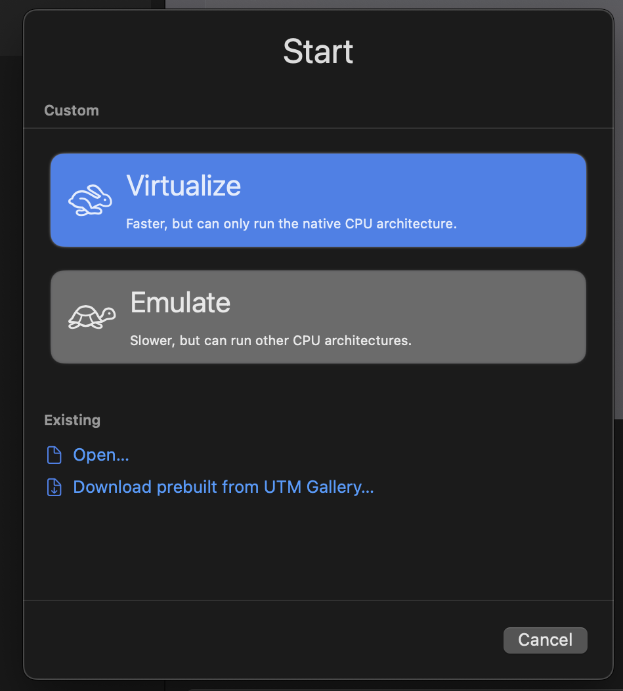
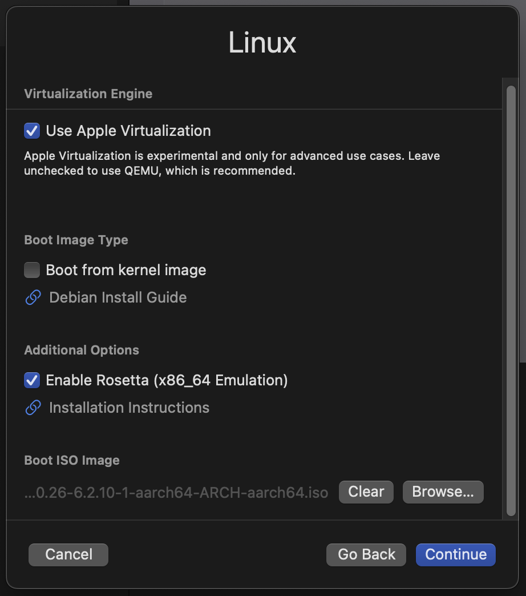
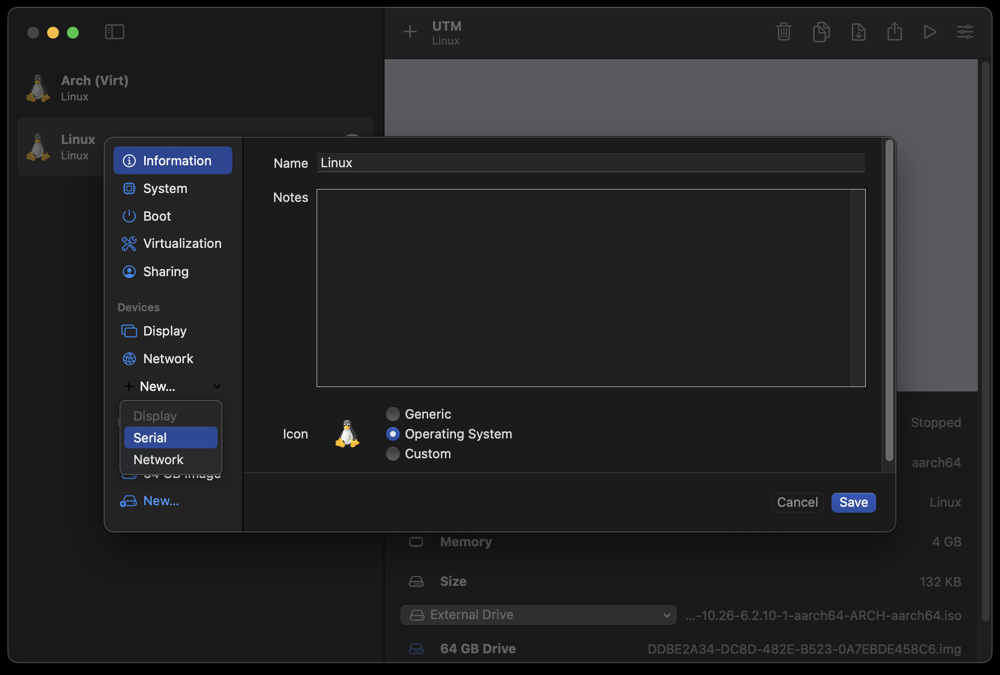
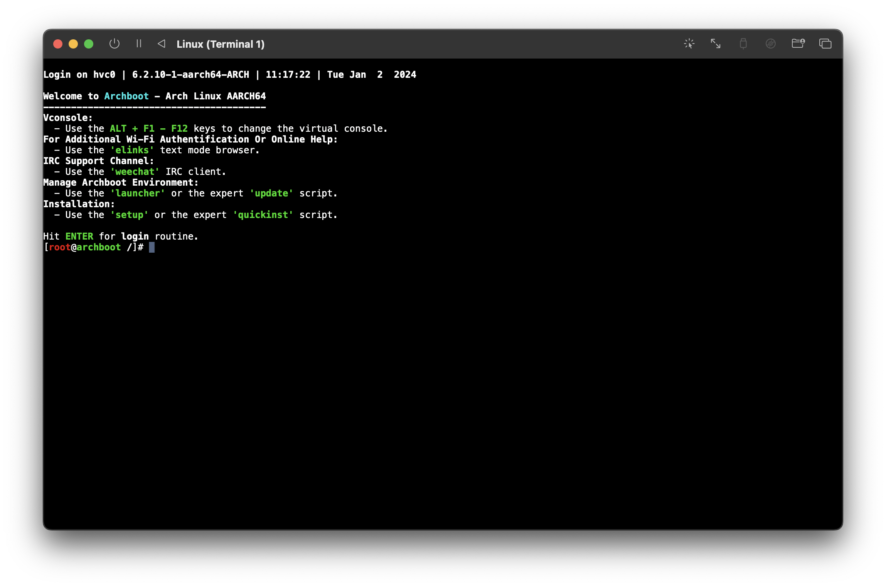

# Creating a Arch Linux VM on an ARM MacBook

This isn't a complete step-by-step guide to installing Arch Linux in a VM on an ARM Mac, but it should have enough information for you to figure the rest out yourself, and save you some time figuring out how to do things.

Here's a brief overview of things I tried, with some of the drawbacks:

| backend              |                             OpenGL | input capture support | x86_64 support |
| :------------------- | ---------------------------------: | --------------------: | -------------: |
| virtualise (`qemu`)  | low version, some apps didn't work |    mouse and keyboard |           none |
| virtualize (`apple`) |                               best |         only keyboard |    via rosetta |
| emulate (`qemu`)     | low version, some apps didn't work |    mouse and keyboard |    full (slow) |

> I couldn't get a LUKS decryption prompt working at all with the `virtualize (apple)` backend. I'll have to have a deeper look into that at a later date...

Because of the above, I opted to use the `virtualize (apple)` backend so programs using OpenGL would work, and also so I could have x86_64 emulation support in the VM.

# Create the VM

## Step 1: Requirements

* UTM: <https://mac.getutm.app/>
  * This is the application that configures and runs the VM on the macOS host
* ArchBoot: <https://archboot.com/#iso>
  * This is used as the boot environment to install Arch in the VM
  * I used the latest version of the `aarch64` iso image, [you can find it here](https://archboot.com/iso/aarch64/latest/)

## Step 2: Create the VM in UTM

Create a new VM, and select `Virtualize`. This is for the best performance, since it doesn't emulate a different CPU architecture.



Select `Linux`.

Now, make sure to check `Use Apple Virtualizaton` and also `Enable Rosetta (x86_64 Emulation)`. (See the table at the top of this page as to why I chose to use Apple Virtualization instead of QEMU.)

Finally, select the [`archboot` ISO image](https://archboot.com/#iso) you downloaded previously as the `Boot ISO Image`:



Configure your CPU and memory sizes as you desire, as well as your hard disk size. Bear in mind UTM won't pre-allocate the entire hard disk, it will grow as the VM fills it up, so feel free to set it to something large.

You don't _need_ to configure any paths for the `Shared Directory` option now, but you can if you want. You can always update this later. I just selected my host's `~/Desktop` directory.

Finally save the VM.

## Step 3: Boot the VM with a Serial interface

Now, before starting the VM, I recommend adding a `Serial` console to it. The reason is that it enables copying/pasting text from the host (since UTM has a nice serial interface) - this is very handy for running the initial commands and setting up the Arch environment.

You can do so by editing the VM you created and adding a `Serial` device here (just click `Serial` and save it, the defaults are all fine):



Now start the VM, and two windows will appear: one is the display and the other the serial interface. You'll sometimes need to use the display to select archboot in the bootloader, etc. But once archboot configures itself you'll be able to use the serial interface, which is what I did for bootstrapping the Arch system.

## Step 4: Bootstrap Arch Linux

Now that archboot has booted, it will show a prompt. It's entirely up to you how you configure your system, but I just `^C` (remember, I'm using the serial interface) which drops me into a root shell:



<div class="warning">

**Issues installing packages with `pacman`?**

I had many `signature is marginal trust` issues when installing packages with `pacman` in the archboot environment. All the packages build by `Arch Linux ARM Build System <builder@archlinuxarm.org>` were breaking.

I was able to fix this by locally signing the key:

```bash
pacman-key --lsign-key $(pacman-key --list-sig Build | head -2 | tail -1)
```

</div>

Useful information:

* The disk image is at `/dev/vda`
* The kernel package you need to install is `linux-aarch64`
* **I could _not_ get LUKS decryption working at all at boot**
  * I could encrypt the disk just fine, and get everything setup, etc. The issue I faced was when it was time to boot the VM, after exiting `grub` I could never get the LUKS decryption prompt to work. I didn't investigate why fully, so I left my VM disk unencrypted for the time being.

Brief overview of my process (not exact commands, just a summary):

```bash
# Partition `/dev/vda` with `fdisk`
# Created two partitions: /dev/vda1 (1G), and /dev/vda2 (rest)
fdisk /dev/vda

# Format partitions:
mkfs.fat -F32 /dev/vda1
mkfs.ext4 /dev/vda2

# Mount partitions:
mount /dev/vda2 /mnt
mkdir /mnt/boot
mount /dev/vda1 /mnt/boot

# Bootstrap Arch:
pacstrap /mnt base base-devel linux-aarch64 grub efibootmgr vi sudo networkmanager # <...other pkgs...>
genfstab -U /mnt >> /mnt/etc/fstab

# Chroot into installation for final setup:
arch-chroot /mnt

# Set root passwd:
passwd

# Configure a user account:
useradd -m $YOUR_USER
usermod -aG wheel $YOUR_USER
passwd $YOUR_USER
visudo # update sudoers however you want

# Install grub:
grub-install --target=arm64-efi --efi-directory=/boot --bootloader-id=grub
grub-mkconfig -o /boot/grub/grub.cfg

# Anything else you want to configure, things like:
# /etc/locale.conf
# /etc/hosts
# /etc/hostname
# /etc/localtime
# This is all just general system setup. You can follow the recommendations here:
# https://wiki.archlinux.org/title/Installation_guide#Configure_the_system
```

Remember, the most important things to do when bootstrapping the system are:

* Install `linux-aarch64`
* Install a bootloader (I used `grub`)

Now we're ready to exit the `chroot` and `poweroff` the VM.

## Step 5: Final Arch configuration

Install your display manager of choice, I'm not going to tell you what to do here. If you're interested, I installed and used `i3`. This part is up to you, but keep in mind for maximum host-guest compatibility you should stick to using `Xorg` rather than `Wayland` since the SPICE Guest tools don't work with `Wayland`.

### Sharing clipboard between macOS host and Arch guest

Install `spice-vdagent` and `qemu-guest-agent`. Popular window servers (like GNOME and Plasma) should support starting the spice agent automatically via the autostart files  (e.g., `/usr/share/gdm/autostart/LoginWindow/spice-vdagent.desktop`).

Minimal environments like `i3` don't, but simply make sure to spawn `spice-vdagent` when your `i3` session starts.

As long as an `Xorg` server is running, `spice-vdagentd` is running (should automatically start after installing the above packages) and a `spice-vdagent` is also running, clipboard sharing should start working between the macOS host and the Arch guest.

### Auto-resizing the guest display

The `spice-vdagent` and `qemu-guest-agent` packages also automatically support this. If you need to trigger a resolution change manually, it's as easy as running:

```bash
xrandr --output Virtual-1 --auto
```

### Getting sound to work in the Arch guest

By default no soundcards are found. This is actually because archlinuxarm's `linux-aarch64` package is compiled _without_ `CONFIG_SND_VIRTIO` set! A little frustrating, but it can be easily fixed by turning that on and compiling our own kernel.

[Here's a brief overview](https://github.com/utmapp/UTM/discussions/5183#discussioncomment-7968515) of how I did it:

```bash
# clone archlinuxarm's packages repository
git clone https://github.com/archlinuxarm/PKGBUILDs
# enter directory containing `linux-aarch64`'s PKGBUILD
cd PKGBUILDs/core/linux-aarch64
```

Then update the package name, and also ensure that `CONFIG_SND_VIRTIO` is on, I set it to `m` (compile as a module). Here's a diff of the `PKGBUILD`:

```diff
From fae13fc75ab3fd9699d0e1817917d523d8c8e7c4 Mon Sep 17 00:00:00 2001
From: acheronfail <acheronfail@gmail.com>
Date: Fri, 29 Dec 2023 09:04:24 +1030
Subject: [PATCH] CONFIG_SND_VIRTIO=m

---
 core/linux-aarch64/PKGBUILD                                  | 5 ++++-
 ...omebook.install => linux-aarch64-virt-chromebook.install} | 0
 .../{linux-aarch64.install => linux-aarch64-virt.install}    | 0
 3 files changed, 4 insertions(+), 1 deletion(-)
 rename core/linux-aarch64/{linux-aarch64-chromebook.install => linux-aarch64-virt-chromebook.install} (100%)
 rename core/linux-aarch64/{linux-aarch64.install => linux-aarch64-virt.install} (100%)

diff --git a/core/linux-aarch64/PKGBUILD b/core/linux-aarch64/PKGBUILD
index 374820de43..a9bc0a72e7 100644
--- a/core/linux-aarch64/PKGBUILD
+++ b/core/linux-aarch64/PKGBUILD
@@ -3,7 +3,7 @@
 
 buildarch=8
 
-pkgbase=linux-aarch64
+pkgbase=linux-aarch64-virt
 _srcname=linux-6.2
 _kernelname=${pkgbase#linux}
 _desc="AArch64 multi-platform"
@@ -12,6 +12,7 @@ pkgrel=1
 arch=('aarch64')
 url="http://www.kernel.org/"
 license=('GPL2')
+conflicts=('linux-aarch64')
 makedepends=('xmlto' 'docbook-xsl' 'kmod' 'inetutils' 'bc' 'git' 'uboot-tools' 'vboot-utils' 'dtc')
 options=('!strip')
 source=("http://www.kernel.org/pub/linux/kernel/v6.x/${_srcname}.tar.xz"
@@ -53,6 +54,8 @@ prepare() {
   git apply ../0002-arm64-dts-rockchip-disable-pwm0-on-rk3399-firefly.patch
 
   cat "${srcdir}/config" > ./.config
+
+  echo 'CONFIG_SND_VIRTIO=m' >> ./.config
 }
 
 build() {
diff --git a/core/linux-aarch64/linux-aarch64-chromebook.install b/core/linux-aarch64/linux-aarch64-virt-chromebook.install
similarity index 100%
rename from core/linux-aarch64/linux-aarch64-chromebook.install
rename to core/linux-aarch64/linux-aarch64-virt-chromebook.install
diff --git a/core/linux-aarch64/linux-aarch64.install b/core/linux-aarch64/linux-aarch64-virt.install
similarity index 100%
rename from core/linux-aarch64/linux-aarch64.install
rename to core/linux-aarch64/linux-aarch64-virt.install
```

Then build and install the package: `makepkg -si`.

Bear in mind compiling the kernel can take a while... It took my VM a little over an hour to compile it. Once you've installed the kernel with `CONFIG_SND_VIRTIO=m`, just `reboot` and sound will work without any issue.

> Make sure to install `pipewire`, etc if you're running something like `i3` which doesn't do that for you automatically!

### Setup Rosetta for x86_64 emulation in the VM

Setting up Rosetta x86_64 emulation is fairly straightforward on an Arch system. The first thing to do is to mount the `rosetta` into the guest. You can do this a single time with:

```bash
mount -t virtiofs rosetta /media/rosetta
```

And configure it to automatically mount at boot by adding this to `/etc/fstab`:

```txt
rosetta	/media/rosetta	virtiofs	ro,nofail	0	0
```

Next [we have to register the x86_64 binary format with `binfmt`](https://docs.kernel.org/admin-guide/binfmt-misc.html):

```bash
# Create /etc/binfmt.d/rosetta.conf:
mkdir -p /etc/binfmt.d/
echo ':rosetta:M::\\x7fELF\\x02\\x01\\x01\\x00\\x00\\x00\\x00\\x00\\x00\\x00\\x00\\x00\\x02\\x00\\x3e\\x00:\\xff\\xff\\xff\\xff\\xff\\xfe\\xfe\\x00\\xff\\xff\\xff\\xff\\xff\\xff\\xff\\xff\\xfe\\xff\\xff\\xff:/media/rosetta/rosetta:CF' > /etc/binfmt.d/rosetta.conf

# Enable binfmt configuration at boot:
systemctl enable systemd-binfmt.service
```

Next time you boot, you should be able to run x86_64 binaries without trouble at all. This is especially useful for things like docker. Here's an example running an x86_64 docker image in the aarch64 VM:

```bash
# Running aarch64 docker container (native arch):
docker run --rm -ti --platform "linux/arm64" ubuntu uname -a
Linux e92da6d4353c 6.2.0-1-aarch64-virt-ARCH #1 SMP PREEMPT_DYNAMIC Fri Dec 29 08:34:59 ACDT 2023 aarch64 aarch64 aarch64 GNU/Linux

# Running x86_64 docker container (via rosetta):
docker run --rm -ti --platform "linux/amd64" ubuntu uname -a
Linux 46e44ec1d041 6.2.0-1-aarch64-virt-ARCH #1 SMP PREEMPT_DYNAMIC Fri Dec 29 08:34:59 ACDT 2023 x86_64 x86_64 x86_64 GNU/Linux
```

### Setup Shared Directories

This is also very easy. Ensure you've configured a share directory in UTM's settings for the VM. Once you've done that, just:

```bash
mount -t virtiofs share /media/share
```

And configure it to automatically mount at boot by adding this to `/etc/fstab`:

```txt
share	/media/share	virtiofs	ro,nofail	0	0
```

You'll then have all the directories you've shared with your VM appear under `/media/share`. Simple!

### Automatic time synchronisation

One problem with running in a VM, is that when the host operating system (macOS) sleeps, the VM is paused. This means that the VM's time will drift out of sync.

There are a few solutions to this problem that require a network connection, like setting up `ntp` in the guest, etc. But I wanted something more robust and something that worked offline.

My solution was to use a program called `sleepwatcher` on the macOS host, and update the VM's time each time the host wakes up from sleep.

**First, install and configure sleepwatcher on the host:**

```bash
# first, install sleepwatcher on macOS host
brew install sleepwatcher

# next, start its daemon (also starts it on boot/login):
brew services start sleepwatcher
```

Now that `sleepwatcher` is setup on the macOS host, if a script exists at `~/.wakeup` it will be run each time the machine wakes from sleep.

**Create script to set time in VM on wakeup:**

```bash
# on the host:
cat ~/.wakeup
#!/usr/bin/env bash

# Set VM's time to current time:
ssh -o ConnectTimeout=2 vm_user@192.168.64.11 sudo date -s "'$(date)'"
```

There's the `ConnectTimeout` option in case the VM isn't running.
Obviously check the username and IP address of your VM, and update accordingly.
This is mostly just an example.

Also since this uses `ssh`, remember to copy your host's public SSH key to the VM's `~/.ssh/authorized_keys`!

**Configure VM to allow SSH and set time:**

I've set it so any user that's part of the `wheel` group can use `date` without a `sudo` password:

```bash
# in the VM:
cat /etc/sudoers | grep date
%wheel ALL=(root) NOPASSWD: /usr/bin/date *
```

Now, if the VM is running, whenever the macOS host resumes from sleep, it will update the VM's time to the correct time.

# Potentially useful links

These are things I found useful while I was working out all the kinks:

- <https://archboot.com/#iso>
- <https://docs.getutm.app/advanced/rosetta/>
- <https://docs.getutm.app/guest-support/linux/#macos-virtiofs>
- <https://blog.vkhitrin.com/booting-arch-linux-using-apple-virtualization-framework-with-utm/>
- <https://mybyways.com/blog/using-rosetta-in-a-utm-linux-vm-with-docker-on-apple-silicon>
- <https://qiita.com/honeniq/items/eed06c6b436db215b0b0>
