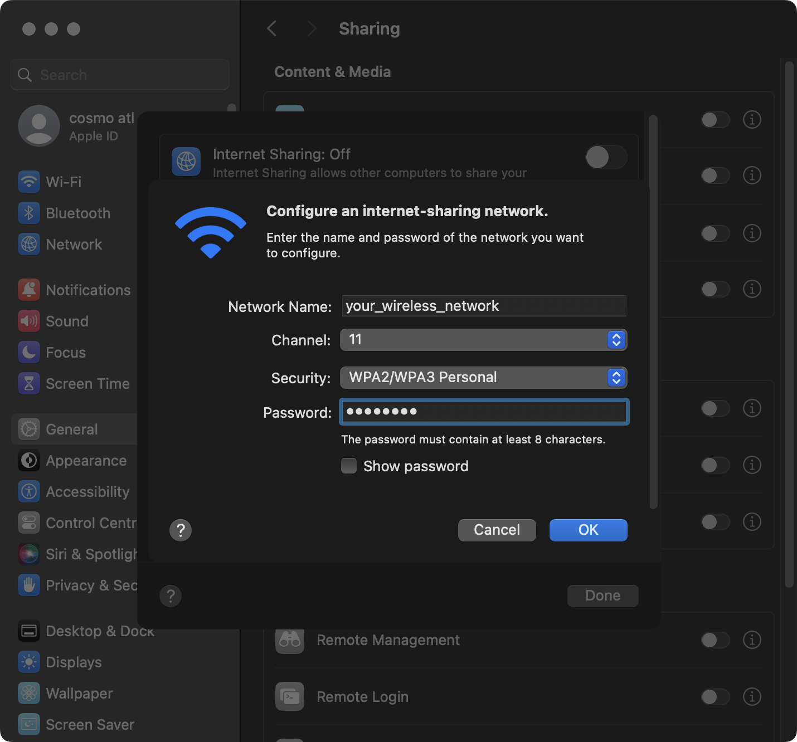

+++
tags = ['macOS', 'network']
+++

# AdHoc Wi-Fi LAN networks on macOS

I recently wanted to host a game of Quake 3 Arena at work. This is a summary of how I got it working on the macOS machines we were using.

- [AdHoc Wi-Fi LAN networks on macOS](#adhoc-wi-fi-lan-networks-on-macos)
  - [How to create an AdHoc Wi-Fi network](#how-to-create-an-adhoc-wi-fi-network)
    - [Step 1: create the ad-hoc network service](#step-1-create-the-ad-hoc-network-service)
    - [Step 2: create the Wi-Fi service](#step-2-create-the-wi-fi-service)
      - [Other tips](#other-tips)


## How to create an AdHoc Wi-Fi network

This requires a few buttons in the **System Settings** app, as well as a couple terminal commands.

### Step 1: create the ad-hoc network service

You can't create the ad-hoc in the macOS GUI on Sonoma (on previous versions this was available). To create one via the terminal, run:

```bash title="Create an ad-hoc network"
# create the network service
sudo networksetup -createnetworkservice AdHoc lo0
```

### Step 2: create the Wi-Fi service

Next we have to create the local wireless network.

To do this, open **System Settings** and navigate to:

* **General**
  * **Sharing**
    * **Internet Sharing** (click the `i` icon)


Next, select the network you created (it's called `AdHoc`) in the **Share your connection from:** select box.

Then, enable the **Wi-Fi** toggle in the **To devices using:** - a configuration dialog will appear where you can define your wireless network's settings.



You're not done yet! Make sure you enable the **Internet Sharing** toggle at the top of the dialog and click done. Also make sure the toggle is on in the previous view.


The wireless network should now be created and running!

#### Other tips

You can enable/disable the wireless network with:

```bash
# disable the network service...
sudo networksetup -setnetworkserviceenabled AdHoc off
# enable the network service...
sudo networksetup -setnetworkserviceenabled AdHoc on
```
