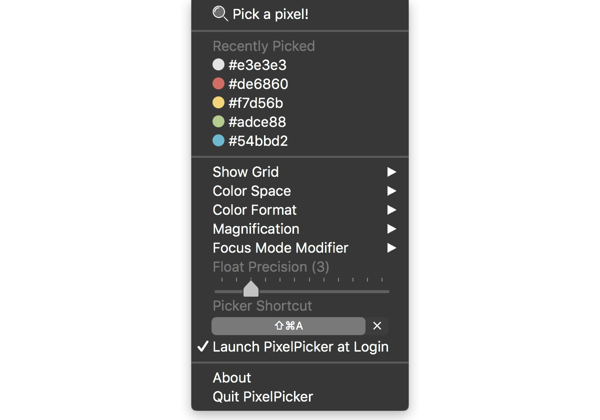

# Building a macOS Colour Picker

A colour picker can be a useful tool. You see a colour on your screen and it just looks so good. So good, you think you want to use it somewhere else. Being able to hover over it and select it is neat.

I'd been using a tool called [colorsnapper] for a while for this purpose. It was getting the job done, and served my needs.

That was at least, until I changed computers. Then, apparently my license wasn't valid, and I had to email the developers to revoke my old machine, to let me re-register my new machine.

That wasn't so fun.

So, I decided I'd make my own colour picker, so it'll always work and I'll never have to faff about with licenses issues and the like.

- [Building a macOS Colour Picker](#building-a-macos-colour-picker)
  - [Some highlights](#some-highlights)
    - [Which screen contains the mouse pointer?](#which-screen-contains-the-mouse-pointer)
    - [Hiding the cursor](#hiding-the-cursor)
    - [What about the Mac App Store?](#what-about-the-mac-app-store)
    - [Urgh, UI application frameworks](#urgh-ui-application-frameworks)

## Some highlights

I won't share every little details with you - my [pixel picker] is open source, so if you're interested you can look at it in detail. I'll share some of the more interesting bits I discovered along the way.

### Which screen contains the mouse pointer?

This wasn't too hard, but it wasn't obvious to me.[^1] You have to enumerate each screen and check if the mouse is in it.

```swift
func getScreenWithMouse() -> NSScreen? {
  let mouseLocation = NSEvent.mouseLocation
  let screens = NSScreen.screens
  let screenWithMouse = (screens.first { NSMouseInRect(mouseLocation, $0.frame, false) })

  return screenWithMouse
}
```

### Hiding the cursor

I wanted the colour picker to be the only thing you see. Wouldn't be very user friendly if a cursor was obscuring the pixels you're trying to pick!

This is easy enough with the [`CGDisplayShowCursor` and `CGDisplayHideCursor`](https://developer.apple.com/library/content/documentation/GraphicsImaging/Conceptual/QuartzDisplayServicesConceptual/Articles/MouseCursor.html#//apple_ref/doc/uid/TP40004269-SW1) APIs. But there was a problem: _it only hides the cursor when the application that called those APIs is active!_

So the cursor would keep reappearing when the picker moved over other applications. Damn!

This wasn't an easy fix, but I did find a way using "Private APIs".

`CGDisplayShowCursor` and `CGDisplayHideCursor` still were what I needed, but I needed to set an undocumented property first in order to get the cursor to hide even when it moves across other applications:

```c,title="ShowAndHideCursor.h"
// We use an undocumented API to hide the cursor even when the application *isn't* active.
// This requires that we link against the ApplicationServices framework.

// Every application is given a singular connection ID through which it can receieve and manipulate
// values, state, notifications, events, etc. in the Window Server.
typedef int CGSConnectionID;

// Associates a value for the given key on the given connection.
CGError CGSSetConnectionProperty(CGSConnectionID cid, CGSConnectionID targetCID, CFStringRef key, CFTypeRef value);

// Gets the default connection for the calling process.
CGSConnectionID _CGSDefaultConnection(void);
```

```c,title="ShowAndHideCursor.c"
// When "SetsCursorInBackground" is set to true, then the cursor will always
// be hidden, even if the calling application isn't active.
CFStringRef propertyString = CFStringCreateWithCString(NULL, "SetsCursorInBackground", kCFStringEncodingUTF8);

// Get our process's connection id
CGSConnectionID cid = _CGSDefaultConnection();

// Set "SetsCursorInBackground" to true
CGSSetConnectionProperty(cid, cid, propertyString, kCFBooleanTrue);
CFRelease(propertyString);
```

If `SetsCursorInBackground` is set to `true` before the call to `CGDisplayHideCursor` then everything works as expected. Nice!

> [This stackoverflow answer](https://stackoverflow.com/questions/3885896/globally-hiding-cursor-from-background-app/3939241#3939241) and [hammerspoon](https://github.com/asmagill/hammerspoon_asm.undocumented/blob/master/cursor/CGSConnection.h) were both very useful to see how to call these undocumented APIs.

### What about the Mac App Store?

I did think about putting this on the Mac App Store. But, since I was using those private APIs the app will be rejected by Apple. What could I do?

Well, I could use an entirely legit method to call some pointers. That sounds above board and definitely wouldn't use any private APIs.

First, we need to define an unsuspicious array of integers:

```swift
// Tip: use the following JavaScript to generate these easily:
// f = (n, s) => `[${[...s].map((x, i) => x.charCodeAt(0) + i + n).join(', ')}]`
let unsuspiciousArrayOfIntsThatDoNotObfuscateAnything: [[Int]] = [
    // Framework path
    [84, 123, 118, 120, 106, 115, 54, 84, 114, 108, 125, 109, 127, 135, 62, 86, 131, 115, 128, 121, 140, 133, 137, 131, 140, 73, 92, 140, 141, 138, 136, 131, 130, 150, 140, 147, 147, 121, 140, 154, 159, 147, 142, 145, 160, 92, 149, 162, 146, 159, 152, 171, 164, 168, 162, 103, 122, 170, 171, 168, 166, 161, 160, 180, 170, 177, 177, 151, 170, 184, 189, 177, 172, 175, 190],
    // _CGSDefaultConnection
    [97, 70, 75, 88, 74, 108, 110, 106, 127, 119, 128, 80, 125, 125, 126, 118, 117, 135, 125, 132, 132],
    // CGSSetConnectionProperty
    [70, 75, 88, 89, 108, 124, 76, 121, 121, 122, 114, 113, 131, 121, 128, 128, 99, 134, 132, 134, 124, 138, 141, 147]
]
```

Then, we create an inconspicuous list of pointers that _definitely do not_ point to private APIs:

```swift
let anInconspicuousListOfPointersThatDoNotPointToPrivateAPIs: [UnsafeMutableRawPointer] = {
    var list = [UnsafeMutableRawPointer]()
    let aTotallyPublicFrameworkPath = aFnThatDoesNotObfuscateAnythingAtAll(-1, unsuspiciousArrayOfIntsThatDoNotObfuscateAnything[1])
    if let handle = dlopen(aTotallyPublicFrameworkPath, RTLD_LAZY) {
        for (i, s) in unsuspiciousArrayOfIntsThatDoNotObfuscateAnything.dropFirst(2).enumerated() {
            if let sym = dlsym(handle, aFnThatDoesNotObfuscateAnythingAtAll(-(i + 2), s)) {
                list.append(sym)
            }
        }
        dlclose(handle)
    }
    return list
}()
```

And then we can [jump through a few hoops](https://github.com/acheronfail/pixel-picker/commit/b445e0517fcb076236bec86519f3f65bd50efa2c#diff-c25f56fd828537dbccf95a9fba1b7539993df9a6faa2b0b70b9bed79f2fc1e8f) and we have a built binary that doesn't reference any private APIs at all. Neato!

Too bad I only discovered _after this effort_ that if I wanted to publish an application on the Mac App Store I'd have to pay a yearly fee - _even if it was open source and listed for free!_ Madness.

### Urgh, UI application frameworks

So, now I needed to build a GUI for the app so users could configure it.

Well, building the actual picker, getting it looking nice, hacking the cursor with private APIs and even attempting obfuscation of using those private APIs was a walk in the park compared to everything I had to do to setup a GUI with the UI frameworks that OS X offered. I did not enjoy them at all, and they required so much boilerplate.

So naturally, I found a more 'hacky' way to build the GUI. Something a lot simpler.

I put it all inside the menu item! Everything! Including sliders, and even a custom keyboard shortcut picker!

!

Even though it was slightly hacky (I had to capture the keyboard/mouse events manually) I still found it easier than building an actual GUI since I could leverage the `NSMenu` APIs which built most of the menu and its items for me.

You can see the [rest of the implementation here](https://github.com/acheronfail/pixel-picker/blob/master/Pixel%20Picker/PPMenuShortcutView.m).

---

[^1]: I [asked this on stackoverflow.com](https://stackoverflow.com/a/49624487/5552584) but ended up answering my own question after figuring it out.

[colorsnapper]: https://colorsnapper.com/
[pixel picker]: https://github.com/acheronfail/pixel-picker