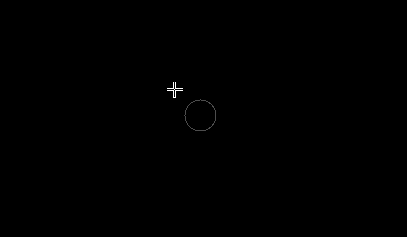
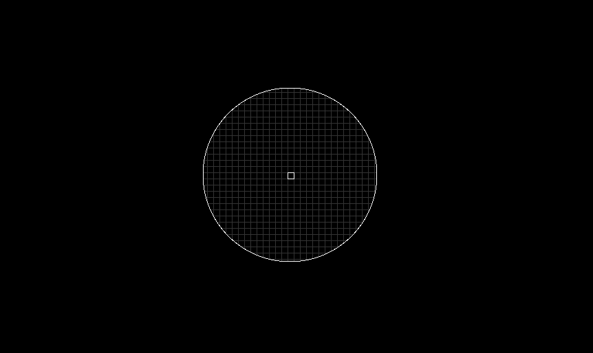
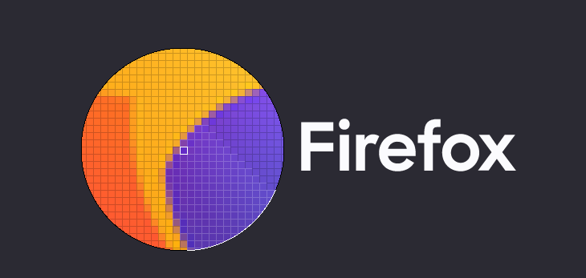
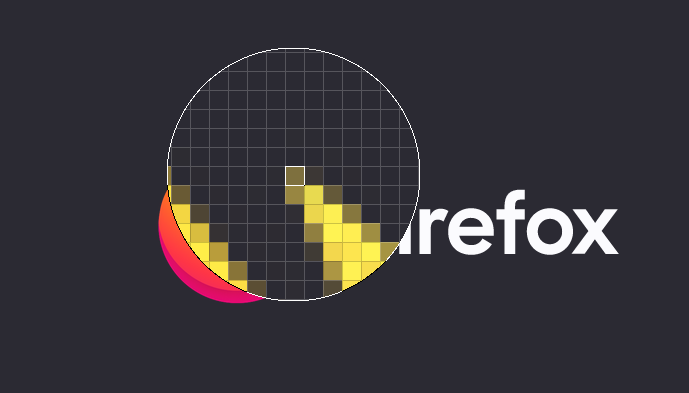
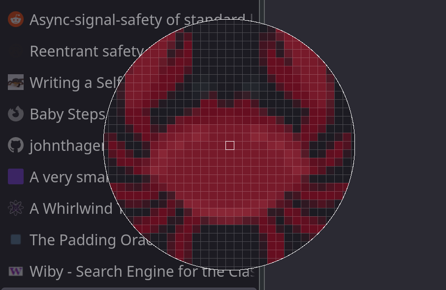

# Building an X11 Colour Picker

One day, I wanted a colour picker on Linux. When I used OS X in the past, [I built my own pixel picker](../pixel-picker/) to satisfy my needs.

From a colour picker, I really just have one requirement: _easily pick the colour of any pixel on the screen_.

There were existing tools like [gpick] and [colorpicker], but - in my opinion - both suffered from a critical usability issue: the preview isn't co-located with the cursor.

This means I have to move the cursor while looking elsewhere at the preview, and it's not a nice experience for me. [^usability] This did not spark joy.

**Then, I found [`xcolor`]**.

This had a small preview that followed the cursor, and looked like this:



This was closer to what I expected. Though, it did have some limitations:

* the preview only showed a single colour at a time (this made it difficult to know exactly which pixel was selected)
* sometimes the preview would be hard to spot in certain situations (see below picture)


Thus began my journey of improving [`xcolor`].

## It's not a simple soluton

The first thing I tried was improving the preview. I had the following goals:

* increase the size of the preview
* render a grid which made each pixel clearly defined in the preview
* ensure the preview was always clearly visible

After quite a bit of hacking, I extended the pixel data we were grabbing from the screen (more than just a single pixel) to make the preview bigger. As I increased the pixel size though, I noticed some problems.

If the region of pixels we were grabbing included the preview window (remember, the preview window hovers just down and to the right of the cursor) then the pixels would just be completely black. Why?

Well, after _a lot_ of trial and error, I discovered that X11's `XGetImage` will return empty data (black) for a 'drawable' (or window) that's obscured by another window (or offscreen). What this meant is that the picker could not be a window and at the same time request pixels underneath it. [^XGetImage] _The size of the preview would be limited by how close it was to the cursor._

This wasn't the only issue with this approach though, I noticed that as I increased the size of the preview, moving the window would be slower and slower and it lag further behind the cursor.

**So, no matter which way I cut it, increasing the size of the preview came at a cost**. What could I do?

## Thinking outside the box

I was thinking a lot about the fact that _I wanted the preview move around with the cursor_. I didn't want it to lag behind the cursor. I didn't want it next to the cursor either, I wanted it underneath the cursor.

I couldn't put it underneath the cursor, since those pixels would then be blacked out.

What if I didn't _need_ to put it _underneath_ the cursor? What if... the preview **was the cursor itself?**

Nah, surely not. _Surely_ that's too dodgy and wouldn't work. _SURELY_.

Well, let's give it a shot, if only to prove that this is a bad idea.

### Creating the cursor

We're already using `XGetImage` to grab a pixel from the screen, it's trivial to update that to get a rectangle of pixels from the screen.

Now we have that rectangle region of pixels, let's use `XcursorImageCreate` to create a custom cursor!

```rust,ignore
// create a cursor of the desired size
let mut cursor_image = XcursorImageCreate(preview_width, preview_width);

// set the "hot spot" - this is where the pointer actually is inside the image
(*cursor_image).xhot = preview_width / 2;
(*cursor_image).yhot = preview_width / 2;

(*cursor_image).pixels = /* ... code to render the preview ... */

// convert our XcursorImage into a cursor
let cursor_id = XcursorImageLoadCursor(conn.get_raw_dpy(), cursor_image);

// free the XcursorImage
XcursorImageDestroy(cursor_image);

// ... `cursor_id` is used elsewhere to change the cursor ...
```

And wow, it actually works!

What's more surprising, is that it's _super fast_!!

Here's what is looks like:





Since we're in total control of what we're drawing - it's just pixels - it was easy to add some configuration options.

For example, the border color of the preview changes depending on the pixels, so it's a easier to see (rather than blending in with its surroundings).

Here's what that looks like, as well as zooming it in further:



And here's another example when the preview size is larger:



What's really cool about this, is that it moves around the screen _extremely fast_: as fast as your cursor moves. Because, well, it IS your cursor!

Since it worked so well, I made [a Pull Request](https://github.com/Soft/xcolor/pull/11/files#r525797831) to `xcolor`. And the rest is history.

> I discovered that there's a limitation to this approach though: if the cursor size is too large.
>
> I don't know why it happens, but it seems if the cursor size exceeds `256x256` then it begins flickering.
>
> You can see my confused investigations [over here](https://github.com/Soft/xcolor/pull/15#issuecomment-730673039).

## A shout out to Rust

So, the pixel data that `XcursorImageCreate` provides is an array of pixel values. When drawing the preview (including the grid lines and each pixel) it's easier to think about things in terms of `x` and `y` coordinates, rather than offsets into a flat array.

Rust makes these kinds of abstractions super simple. Here's a small example:

```rust
# use std::ops::{Index, Deref};
#
// represents x and y coordinates
type Point = (usize, usize);

struct SquareView<T> {
  pixels: T,
  width: usize
}

impl<T, U: Deref<Target = [T]>> Index<Point> for SquareView<U> {
    type Output = T;
    fn index(&self, (x, y): Point) -> &Self::Output {
        &self.pixels[x * self.width + y]
    }
}

fn main() {
  let data = vec![
    1, 2, 3,
    4, 5, 6,
    7, 8, 9
  ];
  let sq_view = SquareView { pixels: &data[..], width: 3 };

  // Look at me go! Coordinates instead of indices! :O
  assert_eq!(sq_view[(0, 0)], 1);
  assert_eq!(sq_view[(1, 1)], 5);
  assert_eq!(sq_view[(2, 2)], 9);
}
```

You can see this abstraction in `xcolor` [over here](https://github.com/Soft/xcolor/blob/969d6525c4568a2fafd321fcd72a95481c5f3c7b/src/pixel.rs#L6-L11).

---

[^usability]: maybe I'm just uncoordinated, but I don't enjoy the experience

[^XGetImage]: I confirmed this later when I found [this discussion](https://lists.freedesktop.org/archives/xorg/2016-July/058163.html) in the freedesktop mailing list. Too late for me though, by then I'd spent many hours trying to find out why before I realised that X11 might not even be rendering those pixels in the first place.

[gpick]: http://www.gpick.org/
[colorpicker]: https://github.com/Jack12816/colorpicker
[`xcolor`]: https://github.com/Soft/xcolor
