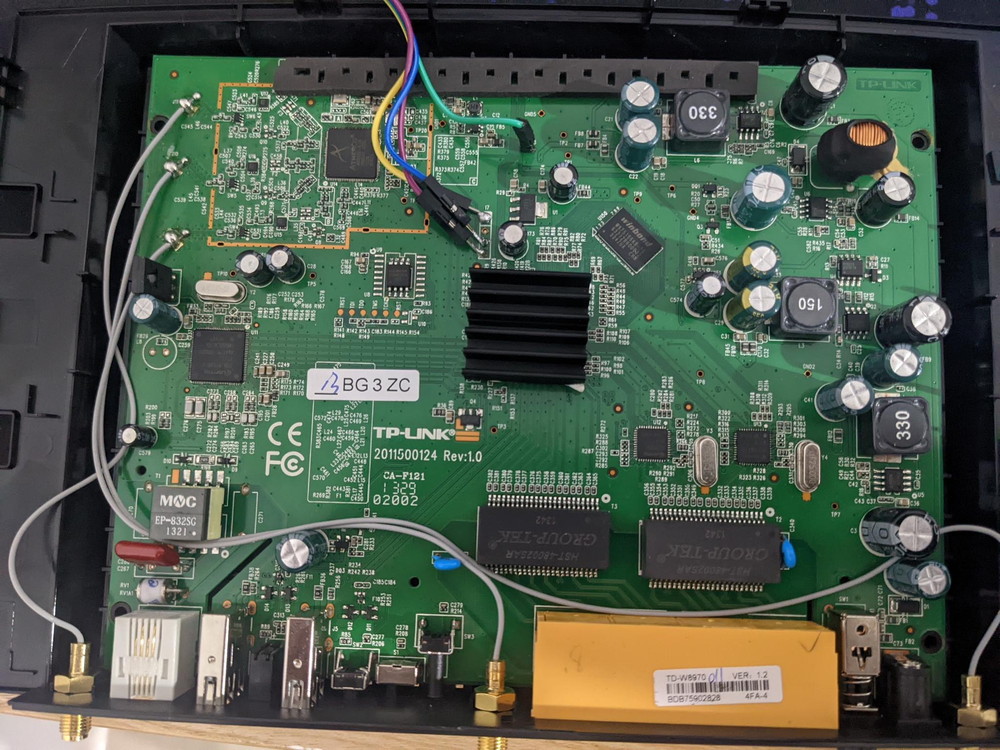
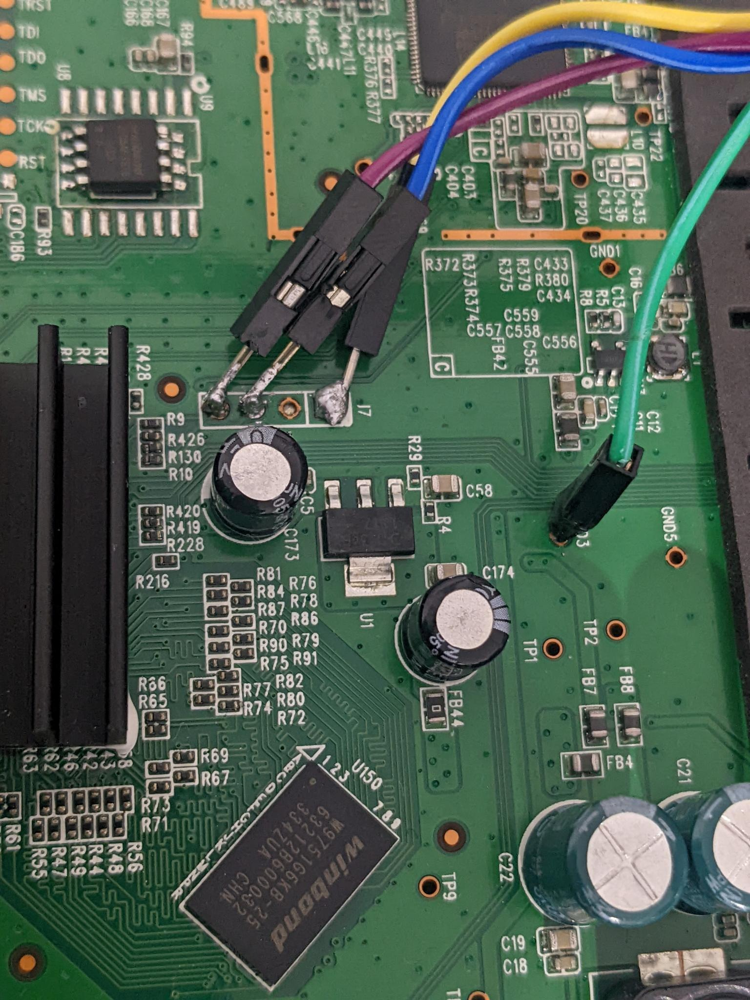
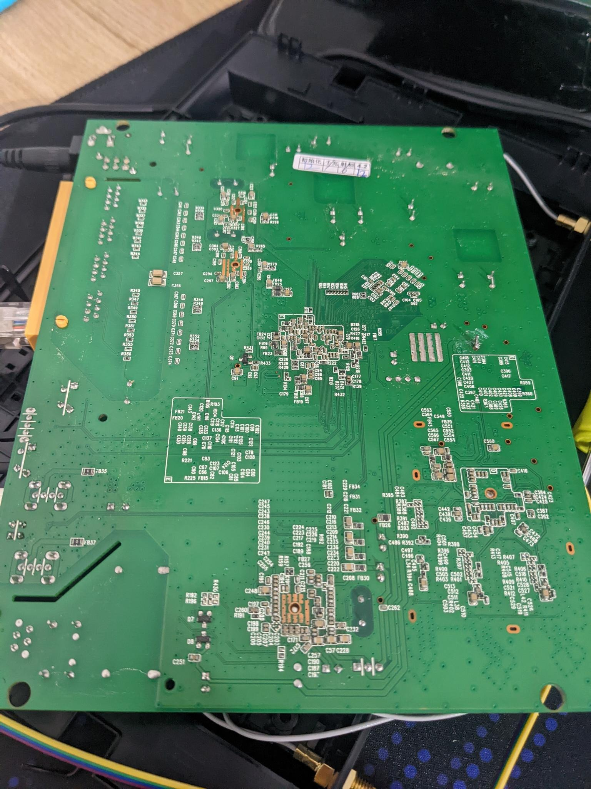
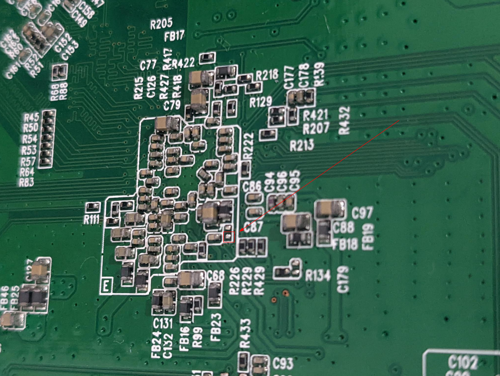

# Transferring files over a serial connection

I had an internet connection that required a DSL modem to use, and so I looked at [openwrt.org] for their DSL compatible modems, and found the [TP-Link TD-W8970 v1]. After an extremely quick glance at top of the page, I saw that ADSL/VDSL works, and proceeded to purchase one since they were quite cheap.

Little did I know this router had a far greater obstacle than I expected...

<!-- more -->

What I neglected to notice on the page for the [TP-Link TD-W8970 v1] was _how to install OpenWrt_ on the device. 😅

Turns out, it's not as simple as other routers I've used in the past (you just download the upgrade package, and install it).
Not all is bad though, this is what is listed in the Installation instructions:

> There are two viable ways to install OpenWrt; the “classic” method using serial access, or the “web interface hack” which allows to flash the firmware without opening the case!

Well! That "web interface hack" sounds pretty good to me!

## Flashing OpenWrt without opening the case

> Unfortunately, the [SSID Config Injection](https://openwrt.org/toh/tp-link/td-w8970_v1#ssid_config_injection) method didn't work with the firmware that the router came pre-installed with. And more unfortunately, after getting a root shell with the [StatPost](https://openwrt.org/toh/tp-link/td-w8970_v1#statpost) method, I _once again_ neglected to read all the finer details of the page and made a mistake.

For what it's worth, the process of flashing the device without opening the case is this:

1. First, download the [15.05 OpenWrt image] for the router
2. Next, once you have a root shell via the [StatPost](https://openwrt.org/toh/tp-link/td-w8970_v1#statpost) approach, backup your router's original firmware:

```bash
# Insert a USB or HDD into one of the USB ports of the router, it will be
# mounted at /var/usbdisk/*
cat /dev/mtd0 > /var/usbdisk/sda1/td-w8970/mtd0
cat /dev/mtd1 > /var/usbdisk/sda1/td-w8970/mtd1
cat /dev/mtd2 > /var/usbdisk/sda1/td-w8970/mtd2
cat /dev/mtd3 > /var/usbdisk/sda1/td-w8970/mtd3
cat /dev/mtd4 > /var/usbdisk/sda1/td-w8970/mtd4
cat /dev/mtd5 > /var/usbdisk/sda1/td-w8970/mtd5
cat /dev/mtd6 > /var/usbdisk/sda1/td-w8970/mtd6
```

3. Check the size of `/dev/mtd1`

```bash
# On my router, it's 1310720 bytes
ls -l /var/usbdisk/sda1/td-w8970/mtd1
```

4. Prepare the 15.05 OpenWrt image

```bash
# Split the install image into two parts. We do this since the image won't fit
# all into /dev/mtd1, and we will put the remaining into /dev/mtd2
dd if=openwrt-lantiq-xrx200-TDW8970-sysupgrade.image bs=1310720 skip=1 of=openwrt-lantiq-xrx200-TDW8970-sysupgrade-1.image
```

5. ⚠️ don't be dumb like me ⚠️

This is the part I missed when reading the installation guide:

> Rumours are that with the recent OpenWrt that you need to take care that the image you write to mtd2 needs to be extended with 0xff characters to the end of the partition

So, please don't do what I did, and please ensure that you do this! 🙏

Get the length of `mtd2`:

```bash
# On my router, it's 6684672 bytes
ls -l /var/usbdisk/sda1/td-w8970/mtd2
```

And as the page suggests, let's extend the image we'll write to `mtd2` with `0xff` characters:

```bash
# Let's extend the second part that we created earlier
# First, we'll create a file full of 0xff bytes that's the right size
# (td uses octal, and 0xff in octal is \377)
dd if=/dev/zero bs=6684672 count=1 | tr "\000" "\377" > mtd2.image
# Now we insert the original file at the start of the image
# Note that `conv=notrunc` will make sure the file isn't truncated
dd if=openwrt-lantiq-xrx200-TDW8970-sysupgrade.image of=mtd2.image conv=notrunc
# And finally, we'll replace the original file with the padded one
mv mtd2.image openwrt-lantiq-xrx200-TDW8970-sysupgrade.image
```

6. Flash OpenWrt to the device

It's crunch time. With the files we created on the computer, let's move them to the USB device
and proceed to flash the router.

```bash
cat /var/usbdisk/sda1/td-w8970/openwrt-lantiq-xrx200-TDW8970-sysupgrade.image > /dev/mtdblock1
cat /var/usbdisk/sda1/td-w8970/openwrt-lantiq-xrx200-TDW8970-sysupgrade-1.image > /dev/mtdblock2
```

> It's normal for the first `cat` command above to print:
>
> ```
> cat: write error: No space left on device
> ```
>
> since the original image is too large for `mtd1`. But that's alright, since we write the remaining portion to `mtd2`.

Once you reboot (by power cycling the device) it _should_ boot in OpenWrt!

..."should" being the key word there... as I mentioned above, I didn't do these all correctly, and my device bricked. 🤦‍♂️

## Unbricking the router

_Sigh_.

Alright, I guess I'm doing this the hard way since I missed that thing about padding the file and my router's now bricked.

Looks like I need to get a USB to TTL Serial UART. I didn't have one, so I purchased this one: <https://core-electronics.com.au/usb-to-ttl-serial-uart-rs232-adaptor-pl2303hx.html>

_... a few days later ..._

Alright, here I am. Following the guide's steps on connecting the adaptor to the [TD-W8970 Serial] interface.
As noted in the guide, the ground pin was a little hard to get to, so I ended up using the alternative they suggested.

This was my result:





And yes, this was my first time soldering. And also yes, I did an awful job.
But hey, the serial connection seems stable, and things are looking fine to me so far!

When I connect to the TTY (if you don't know, [OpenWrt has a good guide](https://openwrt.org/docs/techref/hardware/port.serial)), I see this:

```txt
ROM VER: 1.1.4
CFG 01

ROM VER: 1.1.4
CFG 01

ROM VER: 1.1.4
CFG 01

... repeating endlessly forever ...
```

Hey! I'm actually receiving data that's not completely corrupt - for a first time soldering, I'm just happy it seems to be working.

Well, the guide did mention that pressing `t` will interrupt the boot sequence, and apparently then I can login with `admin/1234`.

... _presses_ <kbd>t</kbd> _and waits_ ...


Oh come on! Nothing's happening. Was it my poor soldering?

Well, if it's not my soldering, then I have to assume inputs are working... Though after mashing the keyboard, nothing seems to change, the characters I'm sending aren't even printed to the TTY... So I'm not even sure.

In the guide there is a section on UART booting; looks like all we have to do is ground a resister called `R255`.
Let's try grounding that.

... _an embarrassingly long amount of time later_ ...

Alright, I swear I looked at every resister a hundred times and I couldn't find the one mentioned on the page.

Don't be thick like me. It's on the bottom side of the board:





So grounding R255 before boot, during boot or after boot did... Nothing.

After a period of time that was far too long, I realised that those guides about pressing `t`, the `admin/1234` login and grounding R255 are for the original router firmware. The original router firmware _that I overwrote already with OpenWrt._ So this isn't TP-Link boot-looping, it's OpenWrt!

After combing through some more OpenWrt forums, some archived, some for other routers, I figured out a way to get it out of it's apparently
bricked and boot-looping state:

As fast as you can after turning it on (you'll see the `ROM VER ...` commands still printing) hit <kbd>ctrl</kbd>+<kbd>C</kbd>!
This stops the boot process and drops me into a shell!

💪 Progress!

### Alright! Now we have a shell again!

So we've got root access to a broken OpenWrt, let's fix this router and unbrick it.

What tools do we have at our disposal?

* 🙁 The wireless doesn't work and can't be setup, or turned on
* 😟 The ethernet ports don't work
* 😫 The USB ports don't work
* 😩 The reset button doesn't seem do anything
* 😢 In fact, this router doesn't do anything except allow a serial connection, and print a bunch of errors about corrupted filesystems while it boots.

Well... Alright. I guess let's just download the latest release of OpenWrt for the device, copy that onto it with the serial connection and then just `sysupgrade` from there. Easy, right?

No. Not so easy.

Apparently, copying binary files over a serial connection isn't the simplest thing.

Especially when the device you're copying to is a very bare-bones system.

### Transferring the new firmware over serial

Let's consider our constraints:

* No network access
* No USB access
* We only have ~29M of RAM on this device, mounted in `/tmp`
* The only way we can communicate is via our Serial UART interface
* We don't have any tools for transferring data easily, in text format, or over serial connections installed on the router

Alright. Let's do this the dumb way.

It may be dumb, but it's simple, and it should work.

My plan is:

1. Download the latest (at this time 21.02.2) OpenWrt firmware for the device
2. Convert this file to ASCII (so it's safe to send over the serial TTY)
3. Send the ASCII file over the serial connection
4. Rebuild the firmware file from its ASCII representation
5. Run `sysupgrade openwrt.bin` on the router and revive it

#### The first problem

The first thing I think of when converting a binary to ASCII is `base64`.

But, if the device doesn't have `base64`, what options do we have?

I did find a [`base64` shell script](https://github.com/mateusza/shellscripthttpd/blob/master/base64.sh) but after some tests that thing totally died on files over a megabyte. The firmware image in its binary format is already 6.4M, and as base64 it's over 9M. Sadly, this wasn't an easy win.

With some more searching, I discovered someone had quite a similar issue to me, and [solved it with `lrzsz`](https://acassis.wordpress.com/2012/10/21/how-to-transfer-files-to-a-linux-embedded-system-over-serial/). Alas, I failed to find any `lrzsz` packages for the later versions of OpenWrt I was using, and even when I tried to use the older ones the router was missing the required libs to even run it. So, rather than transferring an entirely old OS over to the router one file at a time, I decided I'd take inspiration from this approach, but go down a slightly different route.

With that in mind, all I had to do was print every byte of the file in hexadecimal, and rebuild it later on.
That's easy enough:

```bash
# openwrt.bin is the new 21.02.2 image file
xxd -g1 openwrt.bin > openwrt.txt

# remove the prefix and suffix that `xxd` generates
sed -i 's/^\(.\)\{9\}//g' openwrt.txt
sed -i 's/\(.\)\{16\}$//g' openwrt.txt
```

Let's test this can be converted back without `xxd` (since the router doesn't have that):

```bash
# Rebuild it
for b in $(cat openwrt.txt); do printf "\x$b"; done > "openwrt_rebuilt.bin"

# Verify the hashes are the same
md5sum openwrt.bin openwrt_rebuilt.bin
# 38006b415517b27e9da650441e2edb89 openwrt.bin
# 38006b415517b27e9da650441e2edb89 openwrt_rebuilt.bin
```

Awesome! Moving on.

#### The second problem

How do we transmit the file over serial?

Remember I said it was the dumb way? Well now you can be the judge of that!
Here's a simple script to automate sending commands over the serial interface:

```bash
while read line || [[ $line ]]; do echo -e "echo \"$line\" >> openwrt.txt" > /dev/ttyUSB0; done < openwrt.txt
```

> The `read` builtin in `bash` (by default) will read every line until the end of the file.
> If it encounters the end of the file it will return a non-zero exit code (which would end the loop in this case).
>
> Each time it is called though it copies what it read into `$line`.
>
> So, by adding `|| [[ $line ]]` to our loop condition, if there was anything to read before EOF then it will be in `$line` and the loop block will be executed. And the next time `read line` is called there will be nothing to read, so `read` will be non-zero and also `$line` will be empty - so the loop will stop.
> <!-- https://stackoverflow.com/a/65676358/5552584 -->

Whoa, hold on hold on! What's happening in that serial console? Looks like a mess:

```txt
root@(none):/tmp# echo "d0 dd ab 00 b4 8a 09 20 4e 9d 61 81 8c 42 23 cc" >> openwrt.txt
o "4c be c6 c9 a7 7d 09 ec 51 0e 8f 0a a1 16 d2 0d" >> openwrt.txt
echo "39 2b ca 1e 72 8d a8 64 a6 a9 2a a4 d2 22 ae c8" >> openwrt.txt
echroot@(none):/tmp# echo "85 22 89 99 29 27 ae 6a 72 5c 42 0c e3 77 f6 26" >> openwrt.txt
root@(none):/tmp# echo "12 ac f0 77 ba bd 7a 7f 3e 36 3c a3 83 0b e8 7f" >> openwrt.txt
root@(none):/tmp# echo "ff af 4b 79 6a 92 44 4b 98 0e 57 82 bb ea 8e f7" >> openwrt.txt
root@(none):/tmp# echo "03 13 9d b5 08 a8 0e bf d0 5e 50 e1 08 fb bb 8c" >> openwrt.txt
... more lines of garbled output ...
```

Looks like we're transmitting too fast - we're sending the text for the next command before the previous has completed.

I played around with a few settings, and was able to get a stable speed of commands with `sleep 0.005` in between each iteration:

```bash
while read line || [[ $line ]]; do echo -e "echo \"$line\" >> openwrt.txt" > /dev/ttyUSB0; sleep 0.005; done < openwrt.txt
```

Ahh, this looks much better:

```txt
root@(none):/tmp# echo "02 00 00 00 76 65 72 2e 20 31 2e 30 00 ff ff ff" >> openwrt.txt
root@(none):/tmp# echo "ff ff ff ff ff ff ff ff ff ff ff ff ff ff ff ff" >> openwrt.txt
root@(none):/tmp# echo "ff ff ff ff ff ff ff ff ff ff ff ff ff ff ff ff" >> openwrt.txt
root@(none):/tmp# echo "ff ff ff ff 89 70 00 01 00 00 00 01 00 00 00 00" >> openwrt.txt
root@(none):/tmp# echo "fe 9f 5e 8c 19 78 78 21 cc ee dc c5 fa a9 9b 75" >> openwrt.txt
root@(none):/tmp# echo "00 00 00 00 ff ff ff ff ff ff ff ff ff ff ff ff" >> openwrt.txt
root@(none):/tmp# echo "ff ff ff ff ff ff ff ff 80 00 20 00 80 00 20 00" >> openwrt.txt
root@(none):/tmp# echo "00 7a 00 00 00 00 02 00 00 25 d1 2c 00 25 d3 2c" >> openwrt.txt
root@(none):/tmp# echo "00 40 17 36 00 00 00 00 00 00 00 00 55 aa 01 00" >> openwrt.txt
root@(none):/tmp# echo "a5 00 00 00 ff ff ff ff ff ff ff ff ff ff ff ff" >> openwrt.txt
root@(none):/tmp# echo "ff ff ff ff ff ff ff ff ff ff ff ff ff ff ff ff" >> openwrt.txt
root@(none):/tmp# echo "ff ff ff ff ff ff ff ff ff ff ff ff ff ff ff ff" >> openwrt.txt
root@(none):/tmp# echo "ff ff ff ff ff ff ff ff ff ff ff ff ff ff ff ff" >> openwrt.txt
root@(none):/tmp# echo "ff ff ff ff ff ff ff ff ff ff ff ff ff ff ff ff" >> openwrt.txt
root@(none):/tmp# echo "ff ff ff ff ff ff ff ff ff ff ff ff ff ff ff ff" >> openwrt.txt
... more lines ...
```

#### The third problem

The ASCII file we've generated sits just shy of 22M. Whenever I tried to rebuild it into its binary form, the router ran
out of memory and was completely unusable until I either rebooted it, or deleted the `openwrt.txt` or `openwrt.bin` files.

We're so close! I can feel it!

With a few tweaks, I whipped this up to split the file into smaller parts when we transmit it, and then rebuild it
incrementally while cleaning up each part to save on memory:

> Depending on your locale settings the default file sorting may not be the right order for the files generated by the `split ...` command.
>
> I recommend checking first that any `ls x*` or `ls x??` commands output in the order you expect!

```bash
# split ASCII file into 10 parts
split -n 10 openwrt.txt

# transfer the parts over serial (`date` is there to see overall timing and progress)
for f in x??; do echo $f $(date); while read line || [[ $line ]]; do echo -e "echo \"$line\" >> $f" > /dev/ttyUSB0; sleep 0.005; done < $f; done
```

This took around 10 minutes per file over my serial connection.

Excellent! So now we have `xaa`, `xab`, ..., `xaj` on the router. Let's rebuild them one by one:

```bash
# incrementally convert parts back to binary files, deleting them as we go
for f in x??; do echo $f; for b in $(cat $f); do printf "\x$b"; done > "${f}.bin"; rm $f; done;

# join binary files back together
cat x*.bin > openwrt.bin

# check that the file was transferred and rebuilt correctly
md5sum openwrt.bin
# 🎉 THE HASH MATCHES 🎉

# finally, upgrade the router
# `-v` is for verbose output
# optionally pass `-n` to start from a clean slate (all config files deleted)
sysupgrade -v openwrt.bin
```

Oh I am _so ready for this to work now!_ Here we go:

```txt
root@(none):/tmp# sysupgrade -v -n ./openwrt.bin
killall: watchdog: no process killed
Sending TERM to remaining processes ... ubusd 
Sending KILL to remaining processes ... 
Switching to ramdisk...
Performing system upgrade...
Unlocking firmware ...

Writing from <stdin> to firmware ... [w]
Upgrade completed
Rebooting system...
[47068.832000] reboot: Re
ROM VER: 1.1.4
CFG 05

DDR autotuning Rev 1.0
DDR size from 0xa0000000 - 0xa3ffffff
DDR check ok... start booting...


U-Boot 2010.06-svn4806-LANTIQ-v-2.3.08 (Sep 18 2014 - 15:34:40)

CLOCK CPU 500M RAM 250M
DRAM:  64 MiB
Using default environment

In:    serial
Out:   serial
Err:   serial
Net:   Internal phy(GE) firmware version: 0x8434
vr9 Switch8192 KiB W25Q64 at 0:3 is now current device
MAC: c4-e9-84-b0-16-c4  


run "flash_flash" to bring up the kernel

Hit any key to stop autoboot:  0 
8192 KiB W25Q64 at 0:3 is now current device
8192 KiB W25Q64 at 0:3 is now current device
        Uncompressing ... 
Starting kernel ...

[    0.000000] Linux version 5.4.179 (builder@buildhost) (gcc version 8.4.0 (OpenWrt GCC 8.4.0 r16495-bf0c965af0
)) #0 SMP Wed Feb 16 20:29:10 2022

... more booting lines ...
```

OH YES.

OHHHH YESSSS. FINALLY. FANTASTIC.

After I let it boot, I hit `<Enter>` and this is the glory with which I'm presented:

```txt
BusyBox v1.33.2 (2022-02-16 20:29:10 UTC) built-in shell (ash)

  _______                     ________        __
 |       |.-----.-----.-----.|  |  |  |.----.|  |_
 |   -   ||  _  |  -__|     ||  |  |  ||   _||   _|
 |_______||   __|_____|__|__||________||__|  |____|
          |__| W I R E L E S S   F R E E D O M
 -----------------------------------------------------
 OpenWrt 21.02.2, r16495-bf0c965af0
 -----------------------------------------------------
=== WARNING! =====================================
There is no root password defined on this device!
Use the "passwd" command to set up a new password
in order to prevent unauthorized SSH logins.
--------------------------------------------------
root@OpenWrt:/#
```

What a journey.

The router is now unbricked, and has the latest OpenWrt installed. 🎉

Don't be like me, read the whole guide before you even purchase a device! 😅

[openwrt.org]: https://openwrt.org
[TP-Link TD-W8970 v1]: https://openwrt.org/toh/tp-link/td-w8970_v1
[TD-W8970 Serial]: https://openwrt.org/toh/tp-link/td-w8970_v1#serial
[15.05 OpenWrt image]: https://archive.openwrt.org/chaos_calmer/15.05/lantiq/xrx200/
